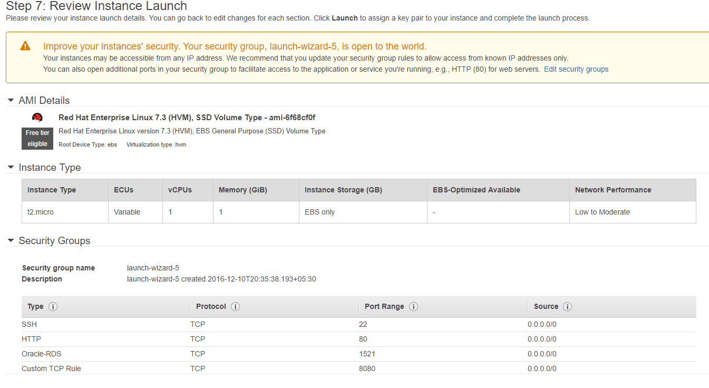

# Technologies Used

Backend:

- Java 1.8.91
- Maven 3.3.9
- Tomcat 8.0.36
- Oracle Express 11g
- Oracle Developer
- SonarCube 5.6
- SonarScanner 2.6.1
- EclipseNeon or SpringToolSuite 3.8 (Optional for development)

Following Dependencies are in package.json, hence no need to install separately:

- Spring 4.3.5
- JUnit 4.12
- Log4j 1.2

# Video
https://www.youtube.com/watch?v=-vxsPC0mS64

# Verification document
docs/FAYA JAVA APP - PHASE 1 UPDATES CODE CHALLENGE.pdf

# POSTMAN Script
docs/faya-dataaccess.postman_collection.json
docs/fundyield-api.postman_collection.json

# Oracle Express 11g Installation
###### This only covers installation. Configuration will be done separately.
## Windows
1. To install Oracle Express 11g for Windows, follow the guide provided in this link: https://docs.oracle.com/cd/E17781_01/install.112/e18803/toc.htm#XEINW124
2. After installation, by default the database is already started. In case the database is stopped, follow this guide on how to start it: https://docs.oracle.com/cd/E17781_01/install.112/e18803/toc.htm#XEINW133

###### For Windows, the Oracle port we will use to connect is 1521.


## Linux (Red Hat Linux 5)
1. To install Oracle Express 11g for Linux, follow the guide provided in this link: http://docs.oracle.com/cd/E17781_01/install.112/e18802/toc.htm#XEINL122

###### For Linux, the Oracle port we will use to connect is 1521.

## Mac OS X (via Docker)
1. Currently, there is no readily available installation package for Mac. To make the installation simpler, we will use Docker. Download Docker for Mac from this link: https://download.docker.com/mac/stable/Docker.dmg
2. Follow the steps (Step 1 is sufficient) in the link to install Docker: https://docs.docker.com/docker-for-mac/#/step-1-install-and-run-docker-for-mac.
3. Open a Terminal and execute the following commands:
   - `docker pull wnameless/oracle-xe-11g`
   - `docker run -d -p 49160:22 -p 49161:1521 -e ORACLE_ALLOW_REMOTE=true wnameless/oracle-xe-11g`

###### For Mac OS X, the Oracle port we will use to connect is 49161. The `system` password is `oracle`.


# Oracle Developer Installation

###### We will use this tool for easier execution of database scripts.

1. Download the appropriate install package from this link: http://www.oracle.com/technetwork/developer-tools/sql-developer/downloads/index.html
2. Installation is pretty straight forward,
3. Configure connection to the local Oracle Express DB. We will need to create 3 connections:
   - For `system` user
   > Connection name: local_system

   > Username: system

   > Password: whatever_you_have_set

   > Hostname: localhost

   > Port: 1521 or 49161

   > SID: xe

   - For `secyield` user
   > Connection name: local_secyield

   > Username: secyield

   > Password: password

   > Hostname: localhost

   > Port: 1521 or 49161

   > SID: xe

   - For `test_secyield` user
   > Connection name: local_test_secyield

   > Username: test_secyield

   > Password: password

   > Hostname: localhost

   > Port: 1521 or 49161

   > SID: xe


# Application setup

- Make sure you have JDK 8 installed and JAVA_HOME is set as path where jdk is installed

#### DB Setup
- Configure the db credentials in  
`faya-dataaccess/src/main/resources/db.properties`   `faya-dataaccess/src/test/resources/test-db.properties`.

- Open Oracle Developer and connect to `local_system` and run `sql/create_user.sql`. This will create the two users `secyield` and `test_secyield`.

- Still in Oracle Developer, connect to `local_secyield`, run `sql/schema.sql` and `sql/procedures.sql`. This will create the table structure and stored procedures for user `secyield`

- Still in Oracle Developer, connect to `local_test_secyield`, run `sql/schema.sql` and `sql/procedures.sql`. This will create the table structure and stored procedures for user `test_secyield`

- In case you want to pre-load some data, in Oracle Developer, connect to `local_secyield` and run `test_data/clear.sql` & `test_data/test_data.sql`.

#### Build all modules
- When running for the first time ojdbc6.jar needs to be added to local maven repository

  1. Go to `faya-dataaccess` folder, run:
  
  ```mvn install:install-file -Dfile=lib/ojdbc6.jar -DgroupId=com.oracle -DartifactId=ojdbc6 -Dversion=11.2.0 -Dpackaging=jar```
  
  2. To build all 3 modules, go to root directory (/backend) and run:

   ```mvn clean install ```
   It will build all 3 modules with tests.

#### Build App
- In `faya-commons` folder, run the following command

  * ```mvn clean install ```

- In `faya-dataaccess` folder, run the following commands

  1. `mvn install:install-file -Dfile=lib/ojdbc6.jar -DgroupId=com.oracle -DartifactId=ojdbc6 -Dversion=11.2.0 -Dpackaging=jar`

  2. ```mvn clean install ```   

  3. Import data from excel  
    `mvn exec:java -Dexec.mainClass=com.csa.apex.fundyield.faya.commands.ImportExcel -Dexec.args="--excel <path to test>\Phase1TestData.xlsx"`

  4. You can clean up calculation table by passing --clean or -c options  
  ```mvn exec:java -Dexec.mainClass=com.csa.apex.fundyield.faya.commands.ImportExcel -Dexec.args=" --clean --excel <path to test>\Phase1TestData.xlsx"```

  5. You can also pass path of mapping properties for excel if excel will change order of columns  
    ```mvn exec:java -Dexec.mainClass=com.csa.apex.fundyield.faya.commands.ImportExcel -Dexec.args="--clean --excel <path to test>/Phase1TestData.xlsx --mapping absolute path of faya-dataaccess\src\main\resources\excelMapping.properties"```

  6. ```mvn spring-boot:run ```  

- In `fundyield-api` folder, run the following commands  

  1. ```mvn clean install ```

  2. ```mvn spring-boot:run ```

To run unit tests, use the following command in `faya-commons`, `faya-dataaccess` and `fundyield-api` folders:

    mvn test

Unit tests are run by default, please use -DskipTests parameter everywhere to skip unit tests, e.g.:

    mvn install -DskipTests

# Deployment to Tomcat

- In `faya-commons` folder, run the following command
   ```
   mvn clean install
   ```

- In `faya-dataaccess` folder, run the following command
   ```
   mvn clean install
   ```
   * Copy generated war (found in `target/faya-dataaccess.war`) to Tomcat webapp directory (`TOMCAT_HOME/webapps`).

- In `fundyield-api` folder, update the URLs in `resources/application.tomcat.properties` to point to the correct `faya-dataaccess` endpoint
   ```properties
   getConfigApiPath=http://localhost:8080/faya-dataaccess/securitySECDataConfiguration
   getSecuritySECDataApiPath=http://localhost:8080/faya-dataaccess/fayaFundAccountingSECYieldData
   saveCalculatedSecuritySECDataApiPath=http://localhost:8080/faya-dataaccess/calculatedFundAccountingSECYieldData
   getCalculatedSecuritySECDataApiPath=http://localhost:8080/faya-dataaccess/calculatedFundAccountingSECYieldData
   ```

- In `fundyield-api` folder, run the following command
   ```
   mvn clean install -Ptomcat
   ```
   * Copy generated war (found in `target/fundyield-api.war`) to Tomcat webapp directory (`TOMCAT_HOME/webapps`).

- Start Tomcat server
- Once started, these will be the endpoints:
  * faya-dataaccess --  `/faya-dataaccess/<service_name>`  [e.g. `/faya-dataaccess/fayaFundAccountingSECYieldData`]
  * fundyield-api --  `/fundyield-api/<service_name>`  [e.g. `/fundyield-api/calculatedFundAccountingSECYieldData`]


# SonarCube Code Coverage for backend

- To use SonarCube code coverage, sonar-project.properties is present in the root folders of faya-commons, faya-dataaccess and fundyield-api modules.
- Go to this link and download latest version of SonarCube Server and SonarCube Scanner:
http://www.sonarqube.org/downloads/
http://docs.sonarqube.org/display/SCAN/Analyzing+with+SonarQube+Scanner

SonarCuber Server Direct link:
https://sonarsource.bintray.com/Distribution/sonarqube/sonarqube-5.6.zip

SonarCube Scanner Direct link:
https://sonarsource.bintray.com/Distribution/sonar-scanner-cli/sonar-scanner-2.6.1.zip

I am following this very simple official guide:
http://docs.sonarqube.org/display/SONAR/Get+Started+in+Two+Minutes

- Now unzip both SonarCube Server & SonarCube Scanner (I prefer at root of C:\ but you can choose other).

- Go to SonarCube Server bin directory where executables are present (select directory inside depending on your operating system).
E.g. C:\sonarqube-5.6\bin\windows-x86-64

- Follow this guide to configure oracle to be used by the sonarcube https://docs.sonarqube.org/display/SONAR/Installing+the+Server
the user to create you can use this command :
```
CREATE USER sonarqube IDENTIFIED BY password DEFAULT TABLESPACE USERS TEMPORARY TABLESPACE TEMP;
GRANT CONNECT, CREATE TABLE,  CREATE TYPE, CREATE PROCEDURE, CREATE SEQUENCE, CREATE TRIGGER TO sonarqube;
ALTER USER sonarqube QUOTA UNLIMITED ON USERS;
```
- Now start the SonarCube Server using StartSonar command or directly click the executable file. You can access the SonarCube dashboard at http://localhost:9000
This is where we will see our report.

- Now open command prompt or terminal and go to the root directory of this project where sonar-project.properties file is present. Run the SonarCube Scanner in the same directory.
E.g. C:\workspace\secyield>c:\sonar-scanner-2.6.1\bin\sonar-scanner

SonarCube will scan our project and details will be populated in the SonarCube dashboard we have at http://localhost:9000

A screenshot is shown in verification guide.

Also one can use  

```mvn sonar:sonar```


# Deployment to AWS

#### AWS Instance Creation
- As a prerequisite, you should have AWS account to create instance on AWS
- Login to AWS and select services ->  EC2 as shown below


- Click on Launch Instance button to create new instance


- Select Red Hat Enterprise Linux 7.3 instance


- On Choose an Instance Type page click Next as default settings is fine
- On Configure Instance Details page click Next as default settings is fine
- On Add Storage page , click on Add New Volume to add 4GB space and click Next, which will be used as SWAP memory


- On Tag page ,you can name your server like webserver or dbserver  for future reference
- On Configure Security Group page, add required inbound ports by clicking AddRule, all below ports(80,8080,1521,22)
should  be added with 	Source as 0.0.0.0/0 and click Review And Launch


- Once you verify all the details click on Launch



- Once you click on Launch, you will be asked to select security key pair, if you don't have any key pair already, click on Download Key Pair
after naming it. This will be used as login credential.


- Once you downloaded key pair click on Launch and View Instances
- Now you can see newly created instance, We need one more instance for Oracle DB
- Right click on Instance and select Launch More like this option to clone this instance


-Review the cloned instance, EBS storage would be missing, you have to add that by going back and edit the tag to name the server.


#### Installation on AWS instance
- Login to web server we created,  using ssh, we need pem file we downloaded while server setup.
- You can use ssh to login to created server using below command.
    ```ssh -i /path to pem/demo.pem ec2-user@serverip```    
- If you are using windows machine and dont have ssh installed, please refer the link for getting ppk file from pem file and using that to login via putty
 https://docs.aws.amazon.com/AWSEC2/latest/UserGuide/putty.html?icmpid=docs_ec2_console
- Default user name would be ec2-user
- Before we start with configuration we have to convert EBS storage we added to SWAP space.
- Run below command to get available disks.
```lsblk -p```
- It will list our EBS disk with 4G as size without any "MOUNTPOINT", in my case it was /dev/xvdb.
- Make /dev/xvdb as swap space using below commands
```sudo mkswap /dev/xvdb
    sudo swapon /dev/xvdb
```
- Now SWAP space has been created, you can verify this using the below command.It will list the drive  /dev/xvdb.

```swapon -s```

- Add the created SWAP space to /etc/fstab by opening file using ```sudo vi /etc/fstab``` and pasting the line ```/dev/xvdb       none    swap    sw  0       0```
at the end of the file
- Follow same procedure to add swap space in another server as well
- Once you login,we have to  execute the script file script/install_sec.sh , this will install apache , tomcat , java , maven and node.
- This script contains different sections for installing different  modules and updating user permissions.
you can edit urls and names in script to install different version if needed.
- You can copy the file using scp / winscp or create new file using  ```vi install_sec.sh```
and copy paste the content of the file. If you are using windows machine , you may have to convert the file to unix format using dos2unix tool , you can use below commands to install dos2unix and covert the file.

```
sudo yum install dos2unix
dos2unix install_sec.sh
```

- Change the file permissions to make the file executable using below command.
        ```chmod +x install_sec.sh```
- Execute the script file using below command. This may take some time to download and install all the required dependencies.
        ```sudo sh install_sec.sh```
- Now we have to configure tomcat as a service.
- Create and open the Systemd  file by below command and copy paste content from script/tomcat.service
```sudo vi /etc/systemd/system/tomcat.service```
- We have to add admin user to tomcat for remote deployment, open the tomcat user file.
```sudo vi /opt/tomcat/conf/tomcat-users.xml```
- Add below line just before ```</tomcat-users>``` tag and save the file.

```
<role rolename="admin"/>
<role rolename="manager-script"/>
<role rolename="manager-gui"/>
<user username="tomcat" roles="admin,manager-script,manager-gui" password="admin" />
```

- Reload Systemd  to load tomcat file
```sudo systemctl daemon-reload```
- Start tomcat using below command
```sudo systemctl start tomcat```
- Make tomcat as a service by below command
```sudo systemctl enable tomcat```

- Start apache httpd server using below command
```sudo service  httpd start```

#### GIT CI Runner configuration
- Before we begin git ci runner configuration, we have to get runner token from the gitlab
- To get runner token, browse the project in gitlab and click on setting icon on top right corner and select Runner


- This page displays runner information and available runners,you should "Disable Shared Runners" here, We will configure our own runners in web server.


- Once you get token, login into web server EC2 instance we created and run below command to register and configure runner.
###### Configuring backend runner
- Execute below command to start the runner configuration.

```sudo gitlab-ci-multi-runner register```

- You will be asked to provide inputs for following questions once you run above command.
    1.Please enter the gitlab-ci coordinator URL (e.g. https://gitlab.com/): https://gitlab.com/ci (obtained from runner page in gitlab)
    2.Please enter the gitlab-ci token for this runner: zmaasJ3Ynq3RXxikwGov (obtained from runner page in gitlab)
    3.Please enter the gitlab-ci description for this runner: backendrunner (runner description here)
    4.Please enter the gitlab-ci tags for this runner (comma separated): backend, java (tags here)
    5.Please enter the executor: docker-ssh, ssh, virtualbox, docker-ssh+machine, kubernetes, docker, parallels, shell, docker+machine: shell (we will be using shell runner)

- Backend runner has been  registered and will be visible in gitlab runner configuration page of the project backend project.
 - Build configuration is given in the file .gitlab-ci.yml of backend project.

###### Configuring frontend runner

 - Browser to frontend's project's runner configuration and get the runner token like we did for backend project.
 - Execute below command to start the runner configuration.

 ```sudo gitlab-ci-multi-runner register```

 - You will be asked to provide inputs for following questions once you run above command.
     1.Please enter the gitlab-ci coordinator URL (e.g. https://gitlab.com/): https://gitlab.com/ci (obtained from runner page in gitlab)
     2.Please enter the gitlab-ci token for this runner: jwasdf3Ynq3RXxikwGov (obtained from runner page in gitlab)
     3.Please enter the gitlab-ci description for this runner: frontendrunner (runner description here)
     4.Please enter the gitlab-ci tags for this runner (comma separated): frontend, angular , node (tags here)
     5.Please enter the executor: docker-ssh, ssh, virtualbox, docker-ssh+machine, kubernetes, docker, parallels, shell, docker+machine: shell (we will be using shell runner)

 - Frontend runner has been  registered and will be visible in gitlab runner configuration page of the project frontend project.
 - Build configuration is given in the file .gitlab-ci.yml of frontend project.


#### Finalizing AWS web server setup.

- We have configured apache and tomcat web servers required to host our frontend and backend.
- Make sure our web servers are up and running, for testing apache hit http://ipaddress/ (ex:http://35.165.104.194/) , for tomcat http://ipaddress:8080/ (ex:http://35.165.104.194:8080/)
- Take a note of web server ip address, we using this in our application configuration file.

#### Oracle XE Configuration on AWS
- Login into next instance of EC2 (dbserver) . This instance will be used as our DB server.
- We need oracle rpm package for installation , it can not be downloaded from server since oracle website required you to login to download.
- You can download package from official site and copy the rpm package through SCP / WinSCP , RPM package size is ~300MB, it may take some time for downloading and uploading depends on your internet speed.
Download link http://www.oracle.com/technetwork/database/database-technologies/express-edition/downloads/index.html
- Here our downloaded file name is oracle-xe-11.2.0-1.0.x86_64.rpm.zip and you can run below commands to install oracle xe

```
sudo yum -y install unzip
sudo yum -y install libaio
sudo yum -y install bc
sudo unzip "oracle-xe-11.2.0-1.0.x86_64.rpm.zip"
cd Disk1
sudo rpm -i oracle-xe-11.2.0-1.0.x86_64.rpm
```

- Once oracle-xe is installed , you can configure using below command.

```sudo /etc/init.d/oracle-xe configure```

- it will be asking for http port, oracle listener port, password for sys, system and load on start up values
- you can leave default for http(8080), oracle listener port (1521) and select y for start on system boot option. Configuration may take some time to complete.
- Once Db is up and running, you can connect to this DB using sql developer and follow steps mentioned in Db Setup section to create user, schema and load sample data.

### Updating application configurations

######Updating backend project properties
- update below files with new webserver ip address /port number and DB server ip  address and port number

fundyield-api\src\main\resources\application.properties
fundyield-api\src\main\resources\application.tomcat.properties
faya-dataaccess\src\main\resources\db.properties
faya-dataaccess\src\test\resources\test-db.properties

######Updating frontend project properties
- Update below file with backend api details
src\client\app\shared\config\app-config.ts

### Triggering build.
- When you commit any changes in develop branch of frontend / backend project , build will be triggered automatically.
- You can monitor the build status from gitlab's Pipeline page. By default you will get a notification mail after every build, to your registered mail id in gitlab.
- If any test case fails or build fails  , maven will return non zero return code, which will stop our build process from proceeding.
- After the build our app will be available at webserver at http://ipaddress/ (ex:http://35.165.104.194/)
